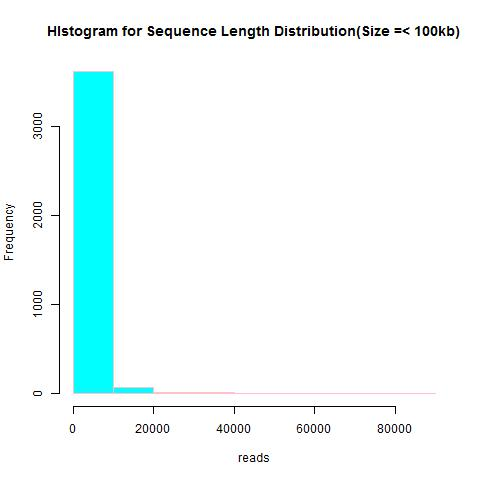
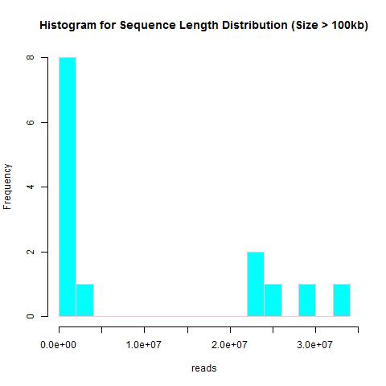
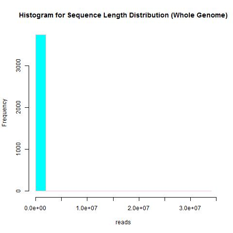
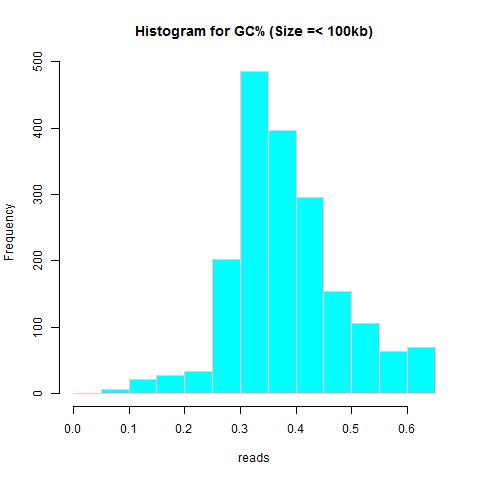
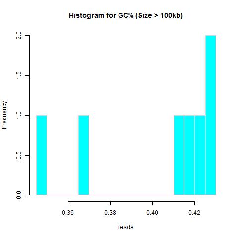
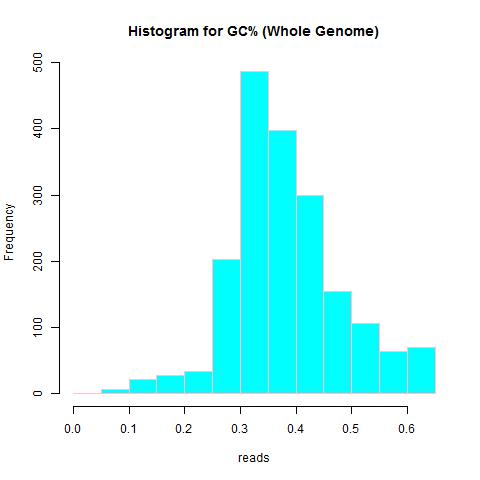
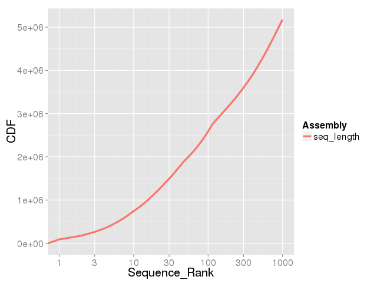
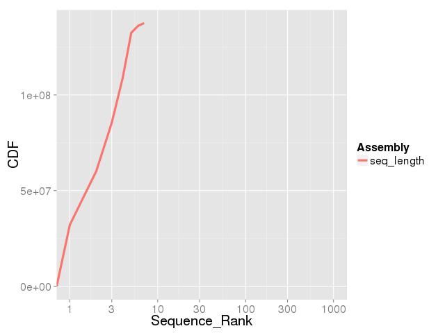
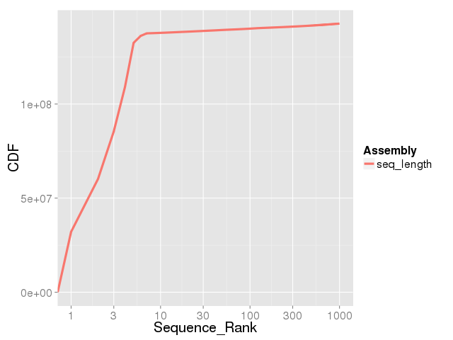

## Homework 4  
### Summarize partitions of a genome assembly
We will be revisiting the Drosophila melanogaster genome. As with Homework 3, start at flybase.org. Go to the most current download genomes section and download the gzipped fasta file for all chromosomes.
> To download the data we can use wget or rsync:
<pre><code>mkdir ./HW4
cd ./HW4 
wget ftp://ftp.flybase.net/genomes/Drosophila_melanogaster/current/fasta/dmel-all-chromosome-r6.24.fasta.gz 
gunzip *.gz 
</code></pre> 
Hint: The partitioning can be accomplished in many different ways. In my opinion, the easiest way is by using bioawk and faSize. The bioawk tool can be found in the module jje/jjeutils and the fa* utilities can be found in the module jje/kent.
#### Calculate the following for all sequences ≤ 100kb and all sequences > 100kb: 
Because the calculations will be for two genome partitions, there will be 6 total responses.
> To filter out the data awk was used and based on the size of the sequences two different .fa files were created:
<pre><code>zcat *.fasta* | awk 'BEGIN{RS=">";ORS=""}length($0)<=100000{print ">"$0}' > fa_lte100.fa
zcat *.fasta* | awk 'BEGIN{RS=">";ORS=""}length($0)>100000{print ">"$0}' > fa_mte100.fa
</code></pre>  
>1. Total number of nucleotides:
<pre><code>grep -v "^>" fa_mt100.fa | tr -d -C 'A\T\G\C\N' | wc -m
</code></pre>  
<pre><code>137547960
</code></pre> 
<pre><code>grep -v "^>" fa_lte100.fa | tr -d -C 'A\T\G\C\N' | wc -m
</code></pre>
<pre><code>6178042
</code></pre> 

>2. Total number of Ns:
<pre><code>grep -v "^>" fa_lte100.fa | tr -d -C 'N' | wc -m
</code></pre> 
<pre><code>662593
</code></pre> 
<pre><code>grep -v "^>" fa_mt100.fa | tr -d -C 'N' | wc -m
</code></pre> 
<pre><code>490385
</code></pre> 

>3. Total number of sequences:
<pre><code>grep -c "^>" fa_lte100.fa
</code></pre>
<pre><code>1863
</code></pre>
<pre><code>grep -c "^>" fa_mt100.fa
</code></pre>
<pre><code>7
</code></pre>

#### Plots of the following for the whole genome, for all sequences ≤ 100kb, and all sequences > 100kb:
Hint: bioawk has a function called gc(). Don't forget about the CDF plotting utility we used in class.Because the calculations will be for the whole genome and two genome partitions, there will be 9 total plots.
> In order to carry out the mentioned commands we download the modules loaded:
<pre><code>module load jje/jjeutils
module load emboss
module load rstudio/0.99.9.9
</code></pre>
>1. Sequence length distribution
<pre><code>infoseq -auto -nocolumns -delimiter ',' -only -noheading -name -length fa_lte100.fa > hist_lte.txt
infoseq -auto -nocolumns -delimiter ',' -only -noheading -name -length fa_mt100.fa > hist_mt.txt
infoseq -auto -nocolumns -delimiter ',' -only -noheading -name -length dmel-all-chromosome-r6.24.fasta > hist_wg.txt
</code></pre>

>2. Sequence GC% distribution
<pre><code>bioawk -c fastx '{ print $name, gc($seq) }' fa_lte100.fa > gc_lte100.txt
bioawk -c fastx '{ print $name, gc($seq) }' fa_mt100.fa > gc_mt100.txt
bioawk -c fastx '{ print $name, gc($seq) }' dmel-all-chromosome-r6.24.fasta > gc_wg.txt
</code></pre>

>3. Cumulative genome size sorted from largest to smallest sequences
<pre><code>bioawk -c fastx ' { print length($seq) } ' fa_lte100.fa | sort -rn | awk ' BEGIN { print "Assembly\tLength\nseq_length\t0" } { print "seq_length\t" $1 } ' > len_lte100.length
plotCDF2  len_lte100.length len_lte100.png
bioawk -c fastx ' { print length($seq) } ' fa_mt100.fa | sort -rn | awk ' BEGIN { print "Assembly\tLength\nseq_length\t0" } { print "seq_length\t" $1 } ' > len_mt100.length
plotCDF2  len_mt100.length len_mt100.png
bioawk -c fastx ' { print length($seq) } ' dmel-all-chromosome-r6.24.fasta | sort -rn | awk ' BEGIN { print "Assembly\tLength\nseq_length\t0" } { print "seq_length\t" $1 } ' > len_wg.length
plotCDF2  len_wg.length len_wg.png
</code></pre>

### Genome assembly
#### Assemble a genome from MinION reads.  
Hint: Read up on miniasm here. We're using one of the simplest assembly approaches possible. This assembly can literally be accomplished with three lines of code. This will literally take only 3 command lines.

>1. Download the reads
<pre><code>wget https://hpc.oit.uci.edu/~solarese/ee282/iso1_onp_a2_1kb.fastq.gz
gunzip *.gz
ln -sf iso1_onp_a2_1kb.fastq reads.fq
</code></pre>
>2. Use minimap to overlap reads
<pre><code>qrsh -q epyc,abio128,free88i,free72i -pe openmp 32      
minimap -t 32 -Sw5 -L100 -m0 reads.fq{,} | gzip -1 > onp.paf.gz
</code></pre>
>3. Use miniasm to construct an assembly
<pre><code>miniasm -f reads.fq onp.paf.gz > reads.gfa
</code></pre>

#### Assembly assessment
Hint: For MUMmer, you should run nucmer, delta-filter, and mummerplot.
>1. Calculate the N50 of your assembly (this can be done with only faSize+awk+sort or with bioawk+awk+sort) and compare it to the Drosophila community reference's contig N50
<pre><code>awk ' $0 ~/^S/ { print ">" $2" \n" $3 } ' reads.gfa \
| tee >(n50 /dev/stdin > n50.txt) \
| fold -w 60 \
> unitigs.fa
n50 () {
  bioawk -c fastx ' { print length($seq); n=n+length($seq); } END { print n; } ' unitigs.fa \
  | sort -rn \
  | gawk ' NR == 1 { n = $1 }; NR > 1 { ni = $1 + ni; } ni/n > 0.5 { print $1; exit; } '
}
</code></pre>
<pre><code>4494246
</code></pre>
>2. Compare your assembly to the contig assembly (not the scaffold assembly!) from Drosophila melanogaster on FlyBase using a dotplot constructed with MUMmer (Hint: use faSplitByN as demonstrated in class)
<pre><code>faSplitByN dmel-all-chromosome-r6.24.fasta wg_contigassembly.fasta 10
source /pub/jje/ee282/bin/.qmbashrc
module load gnuplot/4.6.0
REF="wg_contigassembly.fasta"
PREFIX="flybase"
SGE_TASK_ID=1
QRY=$(ls u*.fa | head -n $SGE_TASK_ID | tail -n 1)
PREFIX=${PREFIX}_$(basename ${QRY} .fa)
nucmer -l 100 -c 150 -d 10 -banded -D 5 -prefix ${PREFIX} ${REF} ${QRY}
mummerplot --fat --layout --filter -p ${PREFIX} ${PREFIX}.delta -R ${REF} -Q ${QRY} --png
</code></pre>
>3. Compare your assembly to both the contig assembly and the scaffold assembly from the Drosophila melanogaster on FlyBase using a contiguity plot (Hint: use plotCDF2 as demonstrated in class)
<pre><code>
</code></pre>
>4. Calculate BUSCO scores of both assemblies and compare them
<pre><code>module load augustus/3.2.1
module load blast/2.2.31 
module load hmmer/3.1b2 
module load boost/1.54.0
source /pub/jje/ee282/bin/.buscorc
INPUTTYPE="geno"
MYLIBDIR="/pub/jje/ee282/bin/busco/lineages/"
MYLIB="diptera_odb9"
OPTIONS="-l ${MYLIBDIR}${MYLIB}"
##OPTIONS="${OPTIONS} -sp 4577"
QRY="unitigs.fa"
MYEXT=".fa"
BUSCO.py -c 4 -i ${QRY} -m ${INPUTTYPE} -o $(basename ${QRY} ${MYEXT})$${MYLIB}${SPTAG} ${OPTIONS}
</code></pre>
<pre><code>module load augustus/3.2.1
module load blast/2.2.31 
module load hmmer/3.1b2 
module load boost/1.54.0
source /pub/jje/ee282/bin/.buscorc
INPUTTYPE="geno"
MYLIBDIR="/pub/jje/ee282/bin/busco/lineages/"
MYLIB="diptera_odb9"
OPTIONS="-l ${MYLIBDIR}${MYLIB}"
QRY="wg_contigassembly.fasta"
MYEXT=".fasta" 
BUSCO.py -c 4 -i ${QRY} -m ${INPUTTYPE} -o $(basename ${QRY} ${MYEXT})_${MYLIB}${SPTAG} ${OPTIONS}
</code></pre>
