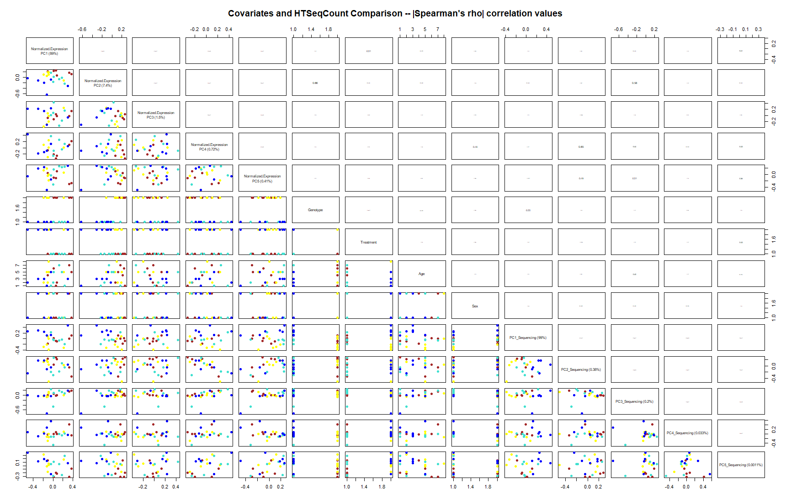
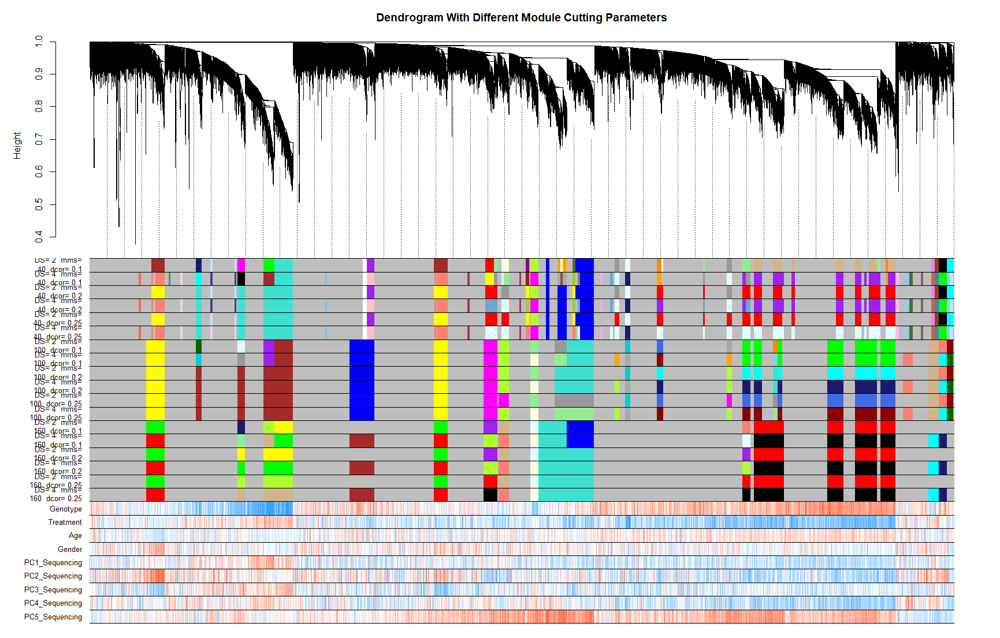
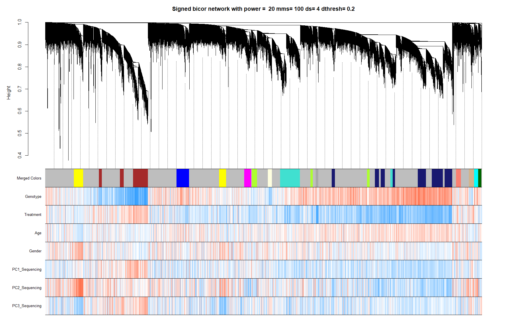
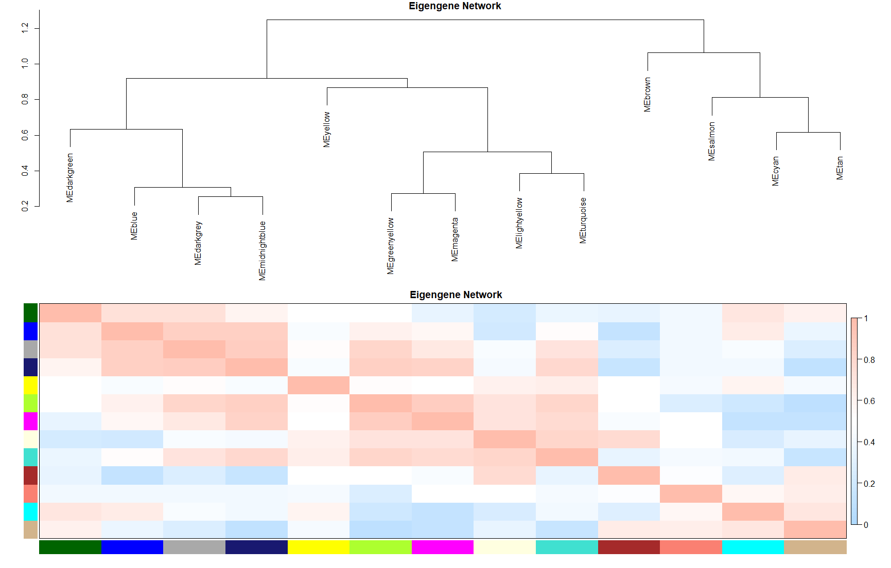
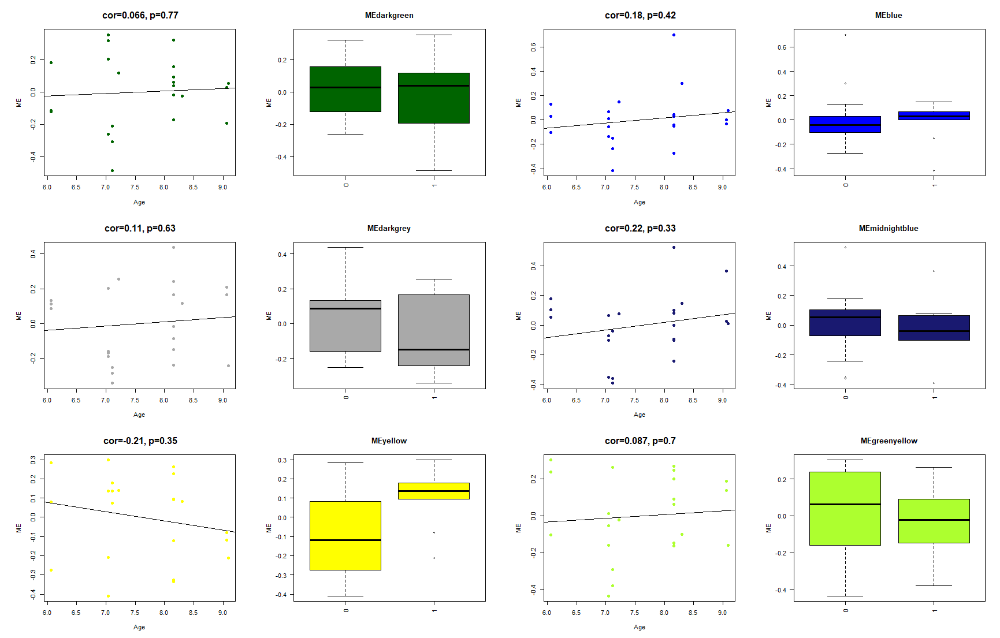
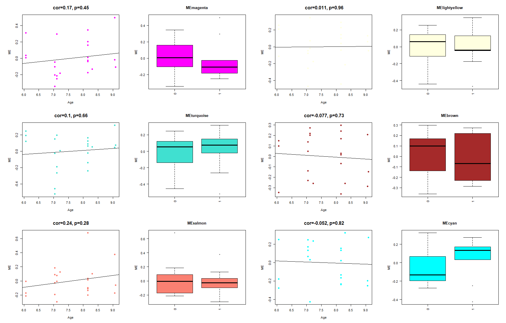
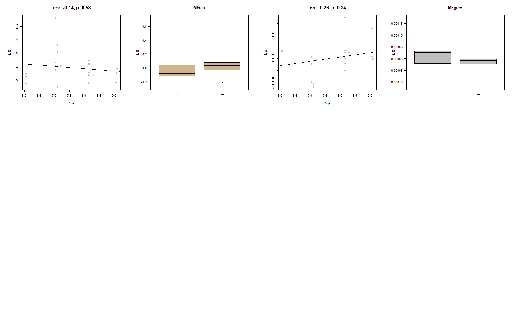
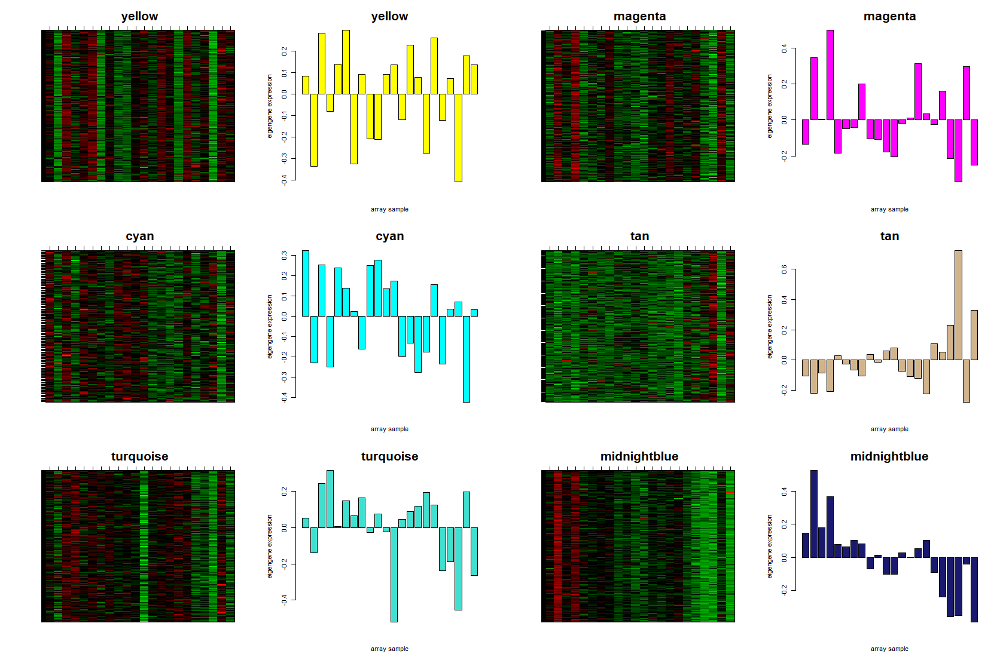
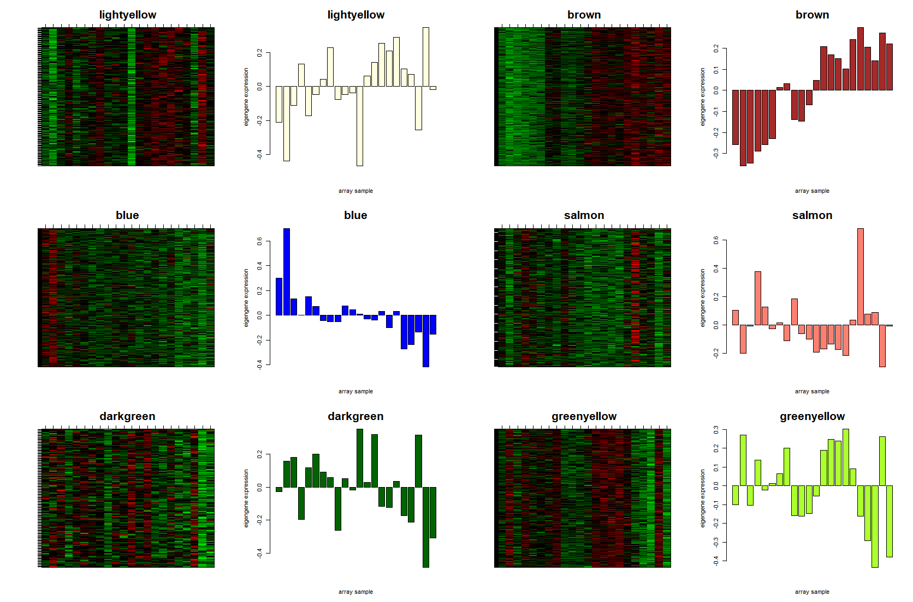
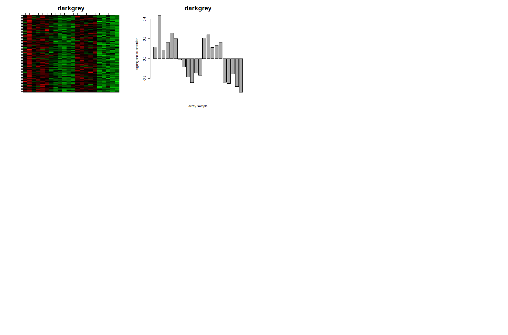

# Linear Regression for WGCNA Analysis
This markdown file will provide a brief description on Weighted Correlation Network Analysis on high-dimensional data.
## STEP 1: Downloading the FASTQ files and Reference Genome.
> To download the .fastq or .fa files from the server, one could use filezilla from the ionode. 
<pre><code>qrsh -q ionode
mkdir ./fastq_files
filezilla
gunzip *.gz
</code></pre>
> The genome could be accessed from the ftp website of [ensembl](http://metazoa.ensembl.org/info/website/ftp/index.html) or [gencode](https://www.gencodegenes.org/) website or [ucsc](http://hgdownload.cse.ucsc.edu/downloads.html) genome website. Once downloaded you would want to concatenate the reference genome such that the chromosomes are in the correct order starting from chromosome 1.
<pre><code>mkdir ./star_genome
wget 'ftp://hgdownload.cse.ucsc.edu/goldenPath/mm10/chromosomes/*
gunzip *.gz
echo "$(ls chr*.fa | sort -V | grep -vP 'chr[^X|Y|\d]'; ls chr*.fa | sort -V | grep -vP 'chr[\d|X|Y]')" | xargs cat > refgenome.fa
</code></pre>
## STEP2: Indexing the genome for STAR
> Indexing is the first step for STAR alignment.
<pre><code>#! /bin/bash/
#$ -N Star_genome_generation
#$ -pe openmp 30
#$ -q bio,epyc,pub8i

module load STAR/2.5.2a
STAR --runMode genomeGenerate --genomeDir /bio/neelakss/star_genome --genomeFastaFiles /bio/neelakss/star_genome/refgenome.fa --runThreadN 24
</code></pre>
### STEP 3: Alignment of fastq files to the refrence genome
> Paired end alignemnt is shown in the code below, however one could refer to the manual. Changing the fastq files in the given code for each sample will give you the alignment for all.
<pre><code>#! /bin/bash/
#$ -N Star_alignment_A1
#$ -pe openmp 10
#$ -q bio,epyc,pub8i

module load STAR/2.5.2a
STAR --genomeDir /bio/neelakss/star-genome  --runThreadN 24 --readFilesIn /bio/neelakss/fastq_files/A1_S1_R1.fastq /bio/neelakss/fastq_files/A1_S1_R2.fastq --outFileNamePrefix A1 --outSAMtype BAM Unsorted SortedByCoordinate
</code></pre>
### STEP 4: Picard Matrix
> As the data is RNA-Seq we need to perform a linear regession on the TPM matrix using the PC values calculated from the alignmnent metrics run on the bam files.
<pre><code>#! /bin/bash/
#$ -N BuildBai_A1
#$ -pe openmp 6
#$ -q epyc,bio,pub8i

module load picard-tools/1.130

java -jar /data/apps/picard-tools/1.130/picard.jar BuildBamIndex I=/bio/neelakss/picard_tools/buildbai/A1Aligned.sortedByCoord.out.bam
</code></pre>
<pre><code>#! /bin/bash/
#$ -N PCA_Req_Data_A1
#$ -pe openmp 6
#$ -q epyc,bio,pub8i

module load picard-tools/1.130

java -jar /data/apps/picard-tools/1.130/picard.jar CollectAlignmentSummaryMetrics\
 R=refgenome.fa\
 I=/pub/neelakss/picard_tools/buildbai/A1Aligned.sortedByCoord.out.bam\
 O=output.Alignment_Summary_A1.txt

java -jar /data/apps/picard-tools/1.130/picard.jar CollectRnaSeqMetrics \
      I=/pub/neelakss/picard_tools/buildbai/A1Aligned.sortedByCoord.out.bam \
      O=output_A1.RNA_Metrics \
      REF_FLAT=refFlat.txt \
      STRAND=SECOND_READ_TRANSCRIPTION_STRAND 

java -jar /data/apps/picard-tools/1.130/picard.jar CollectGcBiasMetrics \
      I=/pub/neelakss/picard_tools/buildbai/A1Aligned.sortedByCoord.out.bam \
      O=gc_bias_metrics_A1.txt \
      CHART=gc_bias_metrics_A1.pdf \
      S=summary_metrics_A1.txt \
      R=refgenome.fa

java -jar /data/apps/picard-tools/1.130/picard.jar MarkDuplicates \
      I=/pub/neelakss/picard_tools/buildbai/A1Aligned.sortedByCoord.out.bam \
      O=marked_duplicates_A1.bam \
      M=marked_dup_metrics_A1.txt

java -jar /data/apps/picard-tools/1.130/picard.jar AddOrReplaceReadGroups \
      I=/pub/neelakss/picard_tools/buildbai/A1Aligned.sortedByCoord.out.bam \
      O=A1Aligned.sortedByCoord.out.read.bam \
      RGID=HMCVCBGX5.11101.1 \
      RGLB=lib1 \
      RGPL=illumina \
      RGPU=TAAGGC+TCTTAC \
      RGSM=Wildtype1

java -jar /data/apps/picard-tools/1.130/picard.jar CollectGcBiasMetrics \
      I=A1Aligned.sortedByCoord.out.read.bam\
      O=gc_bias_metrics_A1.txt \
      CHART=gc_bias_metrics_A1.pdf \
      S=summary_metrics_A1.txt \
      R=refgenome.fa
</pre></code>
<pre><code>#! /bin/bash/
#$ -N reading_metrics
#$ -pe openmp 6
#$ -q epyc,bio,pub8i

awk ' FNR== 7 ' summary_metrics_A1.txt > GC_Header.txt

awk ' FNR== 8 ' summary_metrics_A1.txt summary_metrics_A2.txt \
summary_metrics_A3.txt summary_metrics_A4.txt \
summary_metrics_A5.txt summary_metrics_A6.txt \
summary_metrics_B1.txt summary_metrics_B2.txt \
summary_metrics_B3.txt summary_metrics_B4.txt \
summary_metrics_B5.txt summary_metrics_B6.txt \
summary_metrics_C1.txt summary_metrics_C2.txt \
summary_metrics_C3.txt summary_metrics_C4.txt \
summary_metrics_C5.txt summary_metrics_C6.txt \
summary_metrics_D1.txt summary_metrics_D2.txt \
summary_metrics_D3.txt summary_metrics_D4.txt \
summary_metrics_D5.txt summary_metrics_D6.txt > GC_Metrics.txt

awk ' FNR== 7 ' output_A1.RNA_Metrics > RNA_Header.txt

awk ' FNR== 8 ' output_A1.RNA_Metrics output_A2.RNA_Metrics \
output_A3.RNA_Metrics output_A4.RNA_Metrics \
output_A5.RNA_Metrics output_A6.RNA_Metrics \
output_B1.RNA_Metrics output_B2.RNA_Metrics \
output_B3.RNA_Metrics output_B4.RNA_Metrics \
output_B5.RNA_Metrics output_B6.RNA_Metrics \
output_C1.RNA_Metrics output_C2.RNA_Metrics \
output_C3.RNA_Metrics output_C4.RNA_Metrics \
output_C5.RNA_Metrics output_C6.RNA_Metrics \
output_D1.RNA_Metrics output_D2.RNA_Metrics \
output_D3.RNA_Metrics output_D4.RNA_Metrics \
output_D5.RNA_Metrics output_D6.RNA_Metrics > RNA_Metrics.txt

awk ' FNR== 7 ' marked_dup_metrics_A1.txt > MDUP_Header.txt

awk ' FNR== 8 ' marked_dup_metrics_A1.txt marked_dup_metrics_A2.txt \
marked_dup_metrics_A3.txt marked_dup_metrics_A4.txt \
marked_dup_metrics_A5.txt marked_dup_metrics_A6.txt \
marked_dup_metrics_B1.txt marked_dup_metrics_B2.txt \
marked_dup_metrics_B3.txt marked_dup_metrics_B4.txt \
marked_dup_metrics_B5.txt marked_dup_metrics_B6.txt \
marked_dup_metrics_C1.txt marked_dup_metrics_C2.txt \
marked_dup_metrics_C3.txt marked_dup_metrics_C4.txt \
marked_dup_metrics_C5.txt marked_dup_metrics_C6.txt \
marked_dup_metrics_D1.txt marked_dup_metrics_D2.txt \
marked_dup_metrics_D3.txt marked_dup_metrics_D4.txt \
marked_dup_metrics_D5.txt marked_dup_metrics_D6.txt > MDUP_Metrics.txt

awk ' FNR== 7 ' output.Alignment_Summary_A1.txt > ALIGSUM_Header.txt

awk ' FNR== 8 ' output.Alignment_Summary_A1.txt output.Alignment_Summary_A2.txt \
output.Alignment_Summary_A3.txt output.Alignment_Summary_A4.txt \
output.Alignment_Summary_A5.txt output.Alignment_Summary_A6.txt \
output.Alignment_Summary_B1.txt output.Alignment_Summary_B2.txt \
output.Alignment_Summary_B3.txt output.Alignment_Summary_B4.txt \
output.Alignment_Summary_B5.txt output.Alignment_Summary_B6.txt \
output.Alignment_Summary_C1.txt output.Alignment_Summary_C2.txt \
output.Alignment_Summary_C3.txt output.Alignment_Summary_C4.txt \
output.Alignment_Summary_C5.txt output.Alignment_Summary_C6.txt \
output.Alignment_Summary_D1.txt output.Alignment_Summary_D2.txt \
output.Alignment_Summary_D3.txt output.Alignment_Summary_D4.txt \
output.Alignment_Summary_D5.txt output.Alignment_Summary_D6.txt > AlIGSUM_Metrics.txt

paste GC_Header.txt RNA_Header.txt MDUP_Header.txt ALIGSUM_Header.txt > Header.txt

paste GC_Metrics.txt RNA_Metrics.txt MDUP_Metrics.txt AlIGSUM_Metrics.txt > Metrics.txt

cat Header.txt Metrics.txt > Full_Metrics.txt

awk -F, '{$1=++i FS $1;}1' OFS=, Full_Metics.txt
</code></pre>
 ### STEP 5: TPM generation using Salmon
> For TPM generation gencode annotation file was used without the chromosome values.
<pre><code>#! /bin/bash/
#$ -N Salmon_A1
#$ -pe openmp 6
#$ -q epyc,bio,pub8i

module load salmon/0.11.3

salmon quant -i /pub/neelakss/genome/gencode.vM18.transcripts_index -l A -1 /bio/neelakss/fastq_files/A1_S1_R1.fastq -2 /bio/neelakss/fastq_files/A1_S1_R2.fastq -o A1_transcripts_quant -g /pub/neelakss/genome/gencode.vM11.annotation.noChr.gtf
</pre></code>
<pre><code>#! /bin/bash/
#$ -N reading_quants
#$ -pe openmp 6
#$ -q epyc,bio,pub8i

for D in ./*;
 do if [ -d "$D" ] ; 
  then cd "$D"; 
   cp quant.genes.sf /pub/neelakss/Salmon/quant.genes.sf_$(basename "$D") ; 
   cd ..; 
 fi; 
done

paste <(cut -f1 quant.genes.sf_A1_transcripts_quant) \
<(cut -f4 quant.genes.sf_A1_transcripts_quant) \
<(cut -f4 quant.genes.sf_A2_transcripts_quant) \
<(cut -f4 quant.genes.sf_A3_transcripts_quant) \
<(cut -f4 quant.genes.sf_A4_transcripts_quant) \
<(cut -f4 quant.genes.sf_A5_transcripts_quant) \
<(cut -f4 quant.genes.sf_A6_transcripts_quant) \
<(cut -f4 quant.genes.sf_B1_transcripts_quant) \
<(cut -f4 quant.genes.sf_B2_transcripts_quant) \
<(cut -f4 quant.genes.sf_B3_transcripts_quant) \
<(cut -f4 quant.genes.sf_B4_transcripts_quant) \
<(cut -f4 quant.genes.sf_B5_transcripts_quant) \
<(cut -f4 quant.genes.sf_B6_transcripts_quant) \
<(cut -f4 quant.genes.sf_C1_transcripts_quant) \
<(cut -f4 quant.genes.sf_C2_transcripts_quant) \
<(cut -f4 quant.genes.sf_C3_transcripts_quant) \
<(cut -f4 quant.genes.sf_C4_transcripts_quant) \
<(cut -f4 quant.genes.sf_C5_transcripts_quant) \
<(cut -f4 quant.genes.sf_C6_transcripts_quant) \
<(cut -f4 quant.genes.sf_D1_transcripts_quant) \
<(cut -f4 quant.genes.sf_D2_transcripts_quant) \
<(cut -f4 quant.genes.sf_D3_transcripts_quant) \
<(cut -f4 quant.genes.sf_D4_transcripts_quant) \
<(cut -f4 quant.genes.sf_D5_transcripts_quant) \
<(cut -f4 quant.genes.sf_D6_transcripts_quant) > TPM.txt
</pre></code>

### STEP 6: R Script for the WGCNA Analysis
<pre><code># Adding packages
library(limma)
library(edgeR)
library(gplots)
library(RColorBrewer)
library(bigmemory)
library(plotrix)
library(tseries)
library(org.Mm.eg.db)
library(GO.db)
library(Glimma)
library(AnnotationDbi)
library(GenomicRanges)
library(ggplot2)
library(rtracklayer)
library(stringi)
library(ggbio)
library(KEGG.db)
library(gage)
library(TxDb.Mmusculus.UCSC.mm10.knownGene)
library(calibrate)
library(DESeq2)
library(ggrepel)
#if(!require(devtools)) install.packages("devtools")
#devtools::install_github("kassambara/ggpubr")
library("ggpubr")
library(data.table)  
library(dplyr) 
library(plyr)
library(purrr)       
library(tidyr)      
library(lubridate)   
library(countrycode) 
library(ggplot2)     
library(scales)     
library(gridExtra)   
library(ggthemes)   
library(viridis)     
library(knitr)      
library(vegetarian)
library(qlcMatrix)
library(forcats)
library(reshape)
library(lattice)
library(WGCNA)
library(flashClust)
require(gridExtra)
require(grid)
library(biomaRt)

# Loading the Diagnostic Metrics Matrix
setwd("C:/Users/neela/Desktop/Miguel/WGCNA/")
metrics_matrix <- read.delim("C:/Users/neela/Desktop/Miguel/WGCNA/Full_Metrics.txt", header =T)
metrics_matrix <- metrics_matrix[,-c(1,8,13,16,28,29,30,31,32,34,35,40,43,44,46,51,57,58,61,62,63,64)]
rownames(metrics_matrix) <- c("A1","A2","A3","A4","A5","A6","B1","B2","B3","B4","B5","B6",
                  "C1","C2","C3","C4","C5","C6","D1","D2","D3","D4","D5","D6")
#diagnosis = c("WT","WT","WT","WT","WT","WT","WTPLX","WTPLX","WTPLX","WTPLX","WTPLX","WTPLX",
#              "HET","HET","HET","HET","HET","HET","HETPLX","HETPLX","HETPLX","HETPLX","HETPLX","HETPLX")
age = c("8m30d","8m16d","6m06d","9m06d","7m22d","7m04d","8m16d","8m16d","7m04d","9m09d","8m16d","7m04d",
        "9m06d","8m16d","6m06d","6m06d","8m16d","7m04d","8m16d","7m11d","7m04d","7m11d","7m11d","6m06d")
sex = c("F","F","F","M","M","M","F","F","F","M","M","M",
        "F","F","F","F","M","M","F","F","F","M","M","M")
genotype = c("WT","WT","WT","WT","WT","WT","WT","WT","WT","WT","WT","WT",
             "HET","HET","HET","HET","HET","HET","HET","HET","HET","HET","HET","HET")
treatment = c("CON","CON","CON","CON","CON","CON","PLX","PLX","PLX","PLX","PLX","PLX",
              "CON","CON","CON","CON","CON","CON","PLX","PLX","PLX","PLX","PLX","PLX")
# Loading the Expresion Matrix
expression_matrix <- read.table("C:/Users/neela/Desktop/Miguel/WGCNA/TPM_req.txt", header =T, row.names = 1, sep=",")
colnames(expression_matrix) <- c("A1","A2","A3","A4","A5","A6","B1","B2","B3","B4","B5","B6",
                                 "C1","C2","C3","C4","C5","C6","D1","D2","D3","D4","D5","D6")

# Removing the Low-ly expressed genes to get to maximum of 20,000 genes
myCPM <- cpm(expression_matrix)
thresh <- myCPM > 2
table(rowSums(thresh))
keep <- rowSums(thresh) >= 2
counts.keep <- expression_matrix[keep,]
summary(keep)
dim(counts.keep)

# To check if the counts pass the threshold
gsg = goodSamplesGenes(counts.keep, verbose = 5);
gsg$allOK 

# Correlation between Matrices and Plot
Correlation_Matrix <- cor(t(counts.keep),metrics_matrix)
tar1= metrics_matrix ## columns with picard metrics
thisdat <- t(scale(tar1,scale=F))
PC.metadata <- prcomp(thisdat,center=F);
topPC1 <- PC.metadata$rotation[,1:5];
varexp <- (PC.metadata$sdev)^2 / sum(PC.metadata$sdev^2)
topvar <- varexp[1:5]
colnames(topPC1) <- paste(colnames(topPC1))
Seq.PC1=as.numeric(topPC1[,1])
Seq.PC2=as.numeric(topPC1[,2])
Seq.PC3=as.numeric(topPC1[,3])
Seq.PC4=as.numeric(topPC1[,4])
Seq.PC5=as.numeric(topPC1[,5])
metrics_matrix$Seq.PC1=Seq.PC1
metrics_matrix$Seq.PC2=Seq.PC2
metrics_matrix$Seq.PC3=Seq.PC3
metrics_matrix$Seq.PC4=Seq.PC4
metrics_matrix$Seq.PC5=Seq.PC5

pairsdat <- data.frame(Genotype=as.numeric(factor(genotype)),Treatment=as.numeric(factor(treatment)),age=as.numeric(factor(age)),sex=as.numeric(factor(sex)),PC1_Sequencing=as.numeric(metrics_matrix$Seq.PC1),PC2_Sequencing=as.numeric(metrics_matrix$Seq.PC2), PC3_Sequencing=as.numeric(metrics_matrix$Seq.PC3),PC4_Sequencing=as.numeric(metrics_matrix$Seq.PC4),PC5_Sequencing=as.numeric(metrics_matrix$Seq.PC5))
colnames(pairsdat) <- c("Genotype","Treatment","Age","Sex",paste(colnames(topPC1),"_Sequencing"," (",signif(100*topvar[1:5],2),"%)",sep=""))

#targets[targets$AgeAtDeath=="90_or_above",7] <- 90 ## above age 90 as 90

#pdf("PCA_CQN_AD.pdf",height=20,width=24)

thisdat.HTSC <- t(scale(t(counts.keep),scale=F))
PC.HTSC <- prcomp(thisdat.HTSC,center=F);
topPC1 <- PC.HTSC$rotation[,1:5];
varexp <- (PC.HTSC$sdev)^2 / sum(PC.HTSC$sdev^2)
topvar <- varexp[1:5]
colnames(topPC1) <- paste("Normalized.Expression\n",colnames(topPC1)," (",signif(100*topvar[1:5],2),"%)",sep="")

cond=labels2colors(c("WT","WT","WT","WT","WT","WT","WTPLX","WTPLX","WTPLX","WTPLX","WTPLX","WTPLX",
                     "HET","HET","HET","HET","HET","HET","HETPLX","HETPLX","HETPLX","HETPLX","HETPLX","HETPLX"))  ## colors

panel.cor <- function(x, y, digits = 2, prefix = "", cex.cor, ...) { ## Useful function for comparing multivariate data
  usr <- par("usr"); on.exit(par(usr))
  par(usr = c(0, 1, 0, 1))
  r <- abs(cor(x, y,use="pairwise.complete.obs",method="pearson"))
  txt <- format(c(r, 0.123456789), digits = digits)[1]
  txt <- paste0(prefix, txt)
  if(missing(cex.cor)) cex.cor <- 0.8/strwidth(txt)
  text(0.5, 0.5, txt, cex = cex.cor * r)
}

panel.cor <- function(x, y, digits = 2, prefix = "", cex.cor, ...) { ## Useful function for comparing multivariate data
  usr <- par("usr"); on.exit(par(usr))
  par(usr = c(0, 1, 0, 1))
  if (class(x) == "numeric" & class(y) == "numeric") {
    r <- abs(cor(x, y,use="pairwise.complete.obs",method="pearson"))
  } else {
    lmout <- lm(y~x)
    r <- sqrt(summary(lmout)$adj.r.squared)
  }
  txt <- format(c(r, 0.123456789), digits = digits)[1]
  txt <- paste0(prefix, txt)
  if(missing(cex.cor)) cex.cor <- 0.8/strwidth(txt)
  text(0.5, 0.5, txt, cex = cex.cor * r)
}

pairs(cbind(topPC1,pairsdat),col= cond,pch=19,upper.panel = panel.cor,main="Covariates and HTSeqCount Comparison -- |Spearman's rho| correlation values")

dev.off()
</code></pre>

<pre><code>
#Outlier Removal

sdout <- 2
## Remove outliers
##Calculate signed, weighted biweight midcorrelation
normadj <- (0.5+0.5*bicor(counts.keep)^2)

## Calculate connectivity
netsummary <- fundamentalNetworkConcepts(normadj)
ku <- netsummary$Connectivity
z.ku <- ku-(mean(ku))/sqrt(var(ku))
## Declare as outliers those samples which are more than sdout sd above the mean connectivity based on the chosen measure
outliers <- (z.ku > mean(z.ku)+sdout*sd(z.ku))|(z.ku < mean(z.ku)-sdout*sd(z.ku))
print(paste("There are ",sum(outliers)," outliers samples based on a bicor distance sample network connectivity standard deviation above ",sdout,sep=""))
print(colnames(counts.keep)[outliers])
print(table(outliers))

datExpr <- counts.keep[,!outliers]
targets <- metrics_matrix[!outliers,]

# Linearly regressing the data 
#diagnosis = c("WT","WT","WT","WT","WT","WT","WTPLX","WTPLX","WTPLX","WTPLX","WTPLX","WTPLX",
#              "HET","HET","HET","HET","HET","HETPLX","HETPLX","HETPLX","HETPLX","HETPLX") # need to exclude the outliers from this data set too
#Group=as.numeric(factor(diagnosis,c('WT','WTPLX','HET','HETPLX')))-1
genotype = c("WT","WT","WT","WT","WT","WT","WT","WT","WT","WT","WT","WT",
             "HET","HET","HET","HET","HET","HET","HET","HET","HET","HET")
Genotype = as.numeric(factor(genotype))-1
treatment = c("CON","CON","CON","CON","CON","CON","PLX","PLX","PLX","PLX","PLX","PLX",
              "CON","CON","CON","CON","CON","PLX","PLX","PLX","PLX","PLX")
Treatment = as.numeric(factor(treatment))-1
sex = c("F","F","F","M","M","M","F","F","F","M","M","M",
        "F","F","F","F","M","F","F","F","M","M")
Sex=as.numeric(factor(sex))-1
age = c("8.30","8.16","6.06","9.06","7.22","7.04","8.16","8.16","7.04","9.09","8.16","7.04",
        "9.06","8.16","6.06","6.06","8.16","8.16","7.11","7.04","7.11","7.11")
Age=as.numeric(age)

datExpr <- counts.keep[,!outliers]
targets <- metrics_matrix[!outliers,]

X = model.matrix(~Genotype+Treatment+Sex+Age+Seq.PC1+Seq.PC2+Seq.PC3+Seq.PC4+Seq.PC5, data = targets )
Y = datExpr
beta = (solve(t(X)%*%X)%*%t(X))%*%t(Y)
b = as.data.frame(t(beta))
to_regress = (as.matrix(X[,c(4:7)]) %*% (as.matrix(beta[c(4:7),])))
datExpr = datExpr - t(to_regress)

# Check if the linear regression removed the dependence 
tar1= targets[,43:47] ## columns with picard metrics
thisdat <- t(scale(tar1,scale=F))
PC.metadata <- prcomp(thisdat,center=F);
topPC1 <- PC.metadata$rotation[,1:5];
varexp <- (PC.metadata$sdev)^2 / sum(PC.metadata$sdev^2)
topvar <- varexp[1:5]
colnames(topPC1) <- paste(colnames(topPC1))
Seq.PC1=as.numeric(topPC1[,1])
Seq.PC2=as.numeric(topPC1[,2])
Seq.PC3=as.numeric(topPC1[,3])
Seq.PC4=as.numeric(topPC1[,4])
Seq.PC5=as.numeric(topPC1[,5])
targets$Seq.PC1=Seq.PC1
targets$Seq.PC2=Seq.PC2
targets$Seq.PC3=Seq.PC3
targets$Seq.PC4=Seq.PC4
targets$Seq.PC5=Seq.PC5

pairsdat <- data.frame(Genotype=as.numeric(factor(genotype)),Treatment=as.numeric(factor(treatment)),age=as.numeric(factor(age)),sex=as.numeric(factor(sex)),PC1_Sequencing=as.numeric(targets$Seq.PC1),PC2_Sequencing=as.numeric(targets$Seq.PC2), PC3_Sequencing=as.numeric(targets$Seq.PC3),PC4_Sequencing=as.numeric(targets$Seq.PC4),PC5_Sequencing=as.numeric(targets$Seq.PC5))
colnames(pairsdat) <- c("Genotype","Treatment","Age","Sex",paste(colnames(topPC1),"_Sequencing"," (",signif(100*topvar[1:5],2),"%)",sep=""))

thisdat.HTSC <- t(scale(t(datExpr),scale=F))
PC.HTSC <- prcomp(thisdat.HTSC,center=F);
topPC1 <- PC.HTSC$rotation[,1:5];
varexp <- (PC.HTSC$sdev)^2 / sum(PC.HTSC$sdev^2)
topvar <- varexp[1:5]
colnames(topPC1) <- paste("Normalized.Expression\n",colnames(topPC1)," (",signif(100*topvar[1:5],2),"%)",sep="")

cond=labels2colors(c("WT","WT","WT","WT","WT","WT","WTPLX","WTPLX","WTPLX","WTPLX","WTPLX","WTPLX",
                     "HET","HET","HET","HET","HET","HET","HETPLX","HETPLX","HETPLX","HETPLX","HETPLX","HETPLX"))  ## colors

panel.cor <- function(x, y, digits = 2, prefix = "", cex.cor, ...) { ## Useful function for comparing multivariate data
  usr <- par("usr"); on.exit(par(usr))
  par(usr = c(0, 1, 0, 1))
  r <- abs(cor(x, y,use="pairwise.complete.obs",method="pearson"))
  txt <- format(c(r, 0.123456789), digits = digits)[1]
  txt <- paste0(prefix, txt)
  if(missing(cex.cor)) cex.cor <- 0.8/strwidth(txt)
  text(0.5, 0.5, txt, cex = cex.cor * r)
}

panel.cor <- function(x, y, digits = 2, prefix = "", cex.cor, ...) { ## Useful function for comparing multivariate data
  usr <- par("usr"); on.exit(par(usr))
  par(usr = c(0, 1, 0, 1))
  if (class(x) == "numeric" & class(y) == "numeric") {
    r <- abs(cor(x, y,use="pairwise.complete.obs",method="pearson"))
  } else {
    lmout <- lm(y~x)
    r <- sqrt(summary(lmout)$adj.r.squared)
  }
  txt <- format(c(r, 0.123456789), digits = digits)[1]
  txt <- paste0(prefix, txt)
  if(missing(cex.cor)) cex.cor <- 0.8/strwidth(txt)
  text(0.5, 0.5, txt, cex = cex.cor * r)
}

pairs(cbind(topPC1,pairsdat),col= cond,pch=19,upper.panel = panel.cor,main="Covariates and HTSeqCount Comparison -- |Spearman's rho| correlation values")
dev.off()
</code></pre>

<pre><code>
# Running WGCNA on linearily regressed data

# Choose a set of soft-thresholding powers
powers = c(c(1:10), seq(from = 12, to=30, by=2))
# Call the network topology analysis function

sft = pickSoftThreshold(as.data.frame(t(datExpr)), powerVector = powers, verbose = 5,networkType="signed",corFnc="bicor")
# Plot the results:
par(mfrow = c(1,2));
cex1 = 0.9;
# Scale-free topology fit index as a function of the soft-thresholding power
plot(sft$fitIndices[,1], -sign(sft$fitIndices[,3])*sft$fitIndices[,2],
     xlab="Soft Threshold (power)",ylab="Scale Free Topology Model Fit,signed R^2",type="n",
     main = paste("Scale independence Control All regions",sep=""));
text(sft$fitIndices[,1], -sign(sft$fitIndices[,3])*sft$fitIndices[,2],
     labels=powers,cex=cex1,col="red");
# this line corresponds to using an R^2 cut-off of h
abline(h=0.90,col="red")
abline(h=0.80,col="blue")
abline(h=0.70,col="orange")
abline(h=0.60,col="green")

# Mean connectivity as a function of the soft-thresholding power
plot(sft$fitIndices[,1], sft$fitIndices[,5],
     xlab="Soft Threshold (power)",ylab="Mean Connectivity", type="n",
     main = paste("Mean connectivity Control All regions",sep=""))
text(sft$fitIndices[,1], sft$fitIndices[,5], labels=powers, cex=cex1,col="red")

 softPower = 20 ; ## Choose the power with R^2 > 0.8
 adjacency = adjacency(as.data.frame(t(datExpr)), power = softPower, type = "signed",corFnc="bicor",corOptions = list(use = 'p', maxPOutliers = 0.1));
 TOM = TOMsimilarity(adjacency);
 dissTOM = 1-TOM
 geneTree = flashClust(as.dist(dissTOM), method = "average");
 
 save(TOM,dissTOM,geneTree,adjacency,softPower,file=paste("TOM.rda",sep=""))

#load(file = "C:/Users/neela/Desktop/Miguel/WGCNA/TOM.rda")
# Relating dendrogram with traits

datExpr = as.data.frame(t(datExpr))
Genotype=as.numeric(factor(genotype))
Treatment=as.numeric(factor(treatment))
Age=as.numeric(age)
Gender=as.numeric(factor(sex))
PC1_Sequencing=as.numeric(targets$Seq.PC1)
PC2_Sequencing=as.numeric(targets$Seq.PC2)
PC3_Sequencing=as.numeric(targets$Seq.PC3)
PC4_Sequencing=as.numeric(targets$Seq.PC4)
PC5_Sequencing=as.numeric(targets$Seq.PC5)

geneSigs=matrix(NA,nrow=9,ncol=ncol(datExpr)) # create a vector to hold the data

for(i in 1:ncol(geneSigs)) {
  
  exprvec=as.numeric(datExpr[,i]) # get the expression vector for ith gene
  genor=bicor(Genotype,exprvec,use="pairwise.complete.obs")
  trtr=bicor(Treatment,exprvec,use="pairwise.complete.obs")
  ager=bicor(Age,exprvec,use="pairwise.complete.obs")
  sexr=bicor(exprvec, Gender,use="pairwise.complete.obs")
  pc1r=bicor(PC1_Sequencing,exprvec,use="pairwise.complete.obs")
  pc2r=bicor(PC2_Sequencing,exprvec,use="pairwise.complete.obs")
  pc3r=bicor(PC3_Sequencing,exprvec,use="pairwise.complete.obs")
  pc4r=bicor(PC4_Sequencing,exprvec,use="pairwise.complete.obs")
  pc5r=bicor(PC5_Sequencing,exprvec,use="pairwise.complete.obs")
  
  geneSigs[,i]=c(genor,trtr,ager,sexr,pc1r,pc2r,pc3r,pc4r,pc5r)
  
  cat('Done for gene...',i,'\n')
}

geneSigs[1,] =numbers2colors(as.numeric(geneSigs[1,]),signed=TRUE,centered=TRUE,blueWhiteRed(100),lim=c(-1,1))
geneSigs[2,] =numbers2colors(as.numeric(geneSigs[2,]),signed=TRUE,centered=TRUE,blueWhiteRed(100),lim=c(-1,1))
geneSigs[3,] =numbers2colors(as.numeric(geneSigs[3,]),signed=TRUE,centered=TRUE,blueWhiteRed(100),lim=c(-1,1))
geneSigs[4,] =numbers2colors(as.numeric(geneSigs[4,]),signed=TRUE,centered=TRUE,blueWhiteRed(100),lim=c(-1,1))
geneSigs[5,] =numbers2colors(as.numeric(geneSigs[5,]),signed=TRUE,centered=TRUE,blueWhiteRed(100),lim=c(-1,1))
geneSigs[6,] =numbers2colors(as.numeric(geneSigs[6,]),signed=TRUE,centered=TRUE,blueWhiteRed(100),lim=c(-1,1))
geneSigs[7,] =numbers2colors(as.numeric(geneSigs[7,]),signed=TRUE,centered=TRUE,blueWhiteRed(100),lim=c(-1,1))
geneSigs[8,] =numbers2colors(as.numeric(geneSigs[8,]),signed=TRUE,centered=TRUE,blueWhiteRed(100),lim=c(-1,1))
geneSigs[9,] =numbers2colors(as.numeric(geneSigs[9,]),signed=TRUE,centered=TRUE,blueWhiteRed(100),lim=c(-1,1))

rownames(geneSigs)=c("Genotype","Treatment","Age","Gender","PC1_Sequencing","PC2_Sequencing","PC3_Sequencing","PC4_Sequencing","PC5_Sequencing")

# Selecting Paramters

mColorh <- mLabelh <- colorLabels <- NULL
for (minModSize in c(40,100,160)) {
  for (dthresh in c(0.1,0.2,0.25)) {
    for (ds in c(2,4)) {
      print("Trying parameters:")
      print(c(minModSize,dthresh,ds))
      tree = cutreeHybrid(dendro = geneTree, pamStage=FALSE, minClusterSize = minModSize, cutHeight = 0.9999, deepSplit = ds, distM = as.matrix(dissTOM))
      merged <- mergeCloseModules(exprData = datExpr,colors = tree$labels,
                                  cutHeight = dthresh)
      mColorh <- cbind(mColorh,labels2colors(merged$colors))
      mLabelh <- c(mLabelh,paste("DS=",ds," mms=\n",minModSize," dcor=",dthresh))
    }
  }
}

mColorh1=cbind(mColorh,geneSigs[1,],geneSigs[2,],geneSigs[3,],geneSigs[4,],geneSigs[5,],geneSigs[6,],geneSigs[7,],geneSigs[8,],geneSigs[9,])
mLabelh1=c(mLabelh,rownames(geneSigs))

pdf(paste("SignedDendro_Region.pdf",sep=""),height=25,width=20)
plotDendroAndColors(geneTree,mColorh1,groupLabels=mLabelh1,addGuide=TRUE,dendroLabels=FALSE,main="Dendrogram With Different Module Cutting Parameters")
dev.off()
</code></pre>

<pre><code>
# Using Paramters to find the clusters 
mms=100
ds =4
dthresh=0.2

tree = cutreeHybrid(dendro = geneTree, pamStage=F, minClusterSize =mms, cutHeight = 0.9999, deepSplit = ds, distM = as.matrix(dissTOM))

merge <- mergeCloseModules(exprData = datExpr,colors = tree$labels, cutHeight = dthresh)
mColorh <- cbind(labels2colors(merge$colors),geneSigs[1,],geneSigs[2,],geneSigs[3,],geneSigs[4,],geneSigs[5,],geneSigs[6,],geneSigs[7,])
mLabelh <- c("Merged Colors",rownames(geneSigs))

pdf(paste("FinalDendro_Region.pdf",sep=""),height=10,width=16)
plotDendroAndColors(geneTree, mColorh, groupLabels = mLabelh,addGuide=TRUE,dendroLabels=FALSE,main= paste("Signed bicor network with power = ",softPower,"mms=",mms,"ds=",ds,"dthresh=",dthresh));
dev.off()
</code></pre>

<pre><code>
# Eigengenes of the new merged modules:
mergedColors = labels2colors(merge$colors);
mergedMEs = merge$newMEs;
MEList=moduleEigengenes(datExpr, colors = mergedColors,softPower= softPower, nPC=1)
MEs=MEList$eigengenes
MEs=orderMEs(MEs)
moduleColors = mergedColors

meInfo<-data.frame(rownames(datExpr), MEs)
colnames(meInfo)[1]= "SampleID"
KMEs<-signedKME(datExpr, MEs,outputColumnName = "kME",corFnc = "bicor")

library(data.table)
genes <- fread("C:/Users/neela/Desktop/Miguel/WGCNA/gencode.vM19.annotation.gtf")
setnames(genes, names(genes), c("chr","source","type","start","end","score","strand","phase","attributes") )

# [optional] focus, for example, only on entries of type "gene", 
# which will drastically reduce the file size
genes <- genes[type == "gene"]

# the problem is the attributes column that tends to be a collection
# of the bits of information you're actually interested in
# in order to pull out just the information I want based on the 
# tag name, e.g. "gene_id", I have the following function:
extract_attributes <- function(gtf_attributes, att_of_interest){
  att <- strsplit(gtf_attributes, "; ")
  att <- gsub("\"","",unlist(att))
  if(!is.null(unlist(strsplit(att[grep(att_of_interest, att)], " ")))){
    return( unlist(strsplit(att[grep(att_of_interest, att)], " "))[2])
  }else{
    return(NA)}
}

# this is how to, for example, extract the values for the attributes of interest (here: "gene_id")
genes$gene_id <- unlist(lapply(genes$attributes, extract_attributes, "gene_id"))
genes$Associated.Gene.Name <- unlist(lapply(genes$attributes, extract_attributes, "gene_name"))
#ensembl=read.csv("/home/vivek/FTD_Seeley/Analysis_Nov2017/ENSG85_Human.csv.gz")

KMEs$Ensembl.Gene.ID=paste(rownames(KMEs))
merged=merge(KMEs,genes,by.x="Ensembl.Gene.ID",by.y="gene_id",all.x=T)
ind=match(KMEs$Ensembl.Gene.ID,merged$Ensembl.Gene.ID)
merged1=merged[ind,]
KME.annot=merged1

geneInfo=as.data.frame(cbind(KME.annot$Ensembl.Gene.ID,KME.annot$Associated.Gene.Name,moduleColors, KMEs))

geneInfo=geneInfo[,-ncol(geneInfo)] # check if last column is Ensembl gene id
# merged gene symbol column
colnames(geneInfo)[1]= "Ensembl.Gene.ID"
colnames(geneInfo)[2]= "GeneSymbol"
colnames(geneInfo)[3]= "Initially.Assigned.Module.Color"

write.csv(geneInfo,file=paste('geneInfoSigned.csv',sep=''))

pdf(paste('Network_Plot_AllControls.pdf',sep=''),width=16,height=12)

par(cex = 1.0)
plotEigengeneNetworks(MEs, "Eigengene Network", marHeatmap = c(3,4,2,2), marDendro = c(0,4,1,2),cex.adjacency = 0.3,plotDendrograms = TRUE, xLabelsAngle = 90,heatmapColors=blueWhiteRed(150)[51:100])
</code></pre>

<pre><code>
##
toplot=t(MEs)
cols=substring(colnames(MEs),3,20)
par(mfrow=c(3,4))
par(mar=c(5,6,4,2))
for (i in 1:nrow(toplot)) {
  verboseScatterplot(x=as.numeric(Age),y=toplot[i,],xlab="Age",ylab="ME",abline=TRUE,cex.axis=1,cex.lab=1,cex=1,col=cols[i],pch=19)
  boxplot(toplot[i,]~factor(Sex),col=cols[i],ylab="ME",main=rownames(toplot)[i],xlab=NULL,las=2)
}

dev.off()
</code></pre>

<pre><code>
# Plotting Module output

geneInfo$SystemCode =rep("En",length=nrow(geneInfo))
background=geneInfo[,"Ensembl.Gene.ID"]
background=as.data.frame(background)

## Output files for GO elite
background <- cbind(background,rep("En",length=length(background)))
colnames(background) <- c("Source_Identifier","SystemCode")
background$Source_Identifier<- gsub("\\..*","",background$Source_Identifier)
setwd("C:/Users/neela/Desktop/Miguel/WGCNA/background_denominator")
write.table(background,"denominator.txt",row.names=FALSE,col.names=TRUE,quote=FALSE,sep="\t")

uniquemodcolors=unique(moduleColors)
uniquemodcolors=uniquemodcolors[uniquemodcolors!='grey']

#i is 11
setwd("C:/Users/neela/Desktop/Miguel/WGCNA/modules")
par(mfrow=c(3,4))
for(i in 1:length(uniquemodcolors)){
  thismod= uniquemodcolors[i]
  ind=which(colnames(geneInfo)==paste("kME",thismod,sep=""))
  thisInfo=geneInfo[geneInfo$Initially.Assigned.Module.Color==thismod, c(1, 20,ind)] ##18=Ensembl.ID, 21="SystemCode",ind=kME value
  colnames(thisInfo) <- c("Source_Identifier","SystemCode","kME")
  mart <- useDataset("mmusculus_gene_ensembl", useMart("ensembl"))
  lgeneid<- gsub("\\..*","",thisInfo$Source_Identifier)
  thisInfo$Source_Identifier <- gsub("\\..*","",thisInfo$Source_Identifier)
  G_list <- getBM(filters= "ensembl_gene_id", attributes= c("ensembl_gene_id","external_gene_name","mgi_symbol"),values=lgeneid,mart= mart)
  thisInfo <- merge(thisInfo,G_list,by.x="Source_Identifier",by.y="ensembl_gene_id")
  plotMat(t(scale(datExpr[,mColorh==thismod ]) ), nrgcols=30,rlabels=F,rcols=thismod, main=thismod, cex.main=2)
  barplot(as.matrix(t(MEs[colnames(MEs)==paste("ME",thismod,sep="")])), col=thismod, main=thismod, cex.main=2, ylab="eigengene expression",xlab="array sample")
  #print(ggplot(req_data.m, aes(names,variable)) + geom_tile(aes(fill = scale(value))) + scale_fill_gradient2(guide=FALSE,low = muted("steelblue1"), high ="red")+ theme_grey(base_size = 9)+ labs(x = "", y = "")+scale_x_discrete(expand = c(0, 0)) + scale_y_discrete(expand = c(0, 0))+ theme(text = element_text(size=22),axis.title.y=element_blank(),axis.text.y=element_blank(),axis.ticks.y=element_blank(),axis.title.x=element_blank(),axis.text.x=element_blank(),axis.ticks.x=element_blank())+ ggtitle(thismod))
  }
</code></pre>

